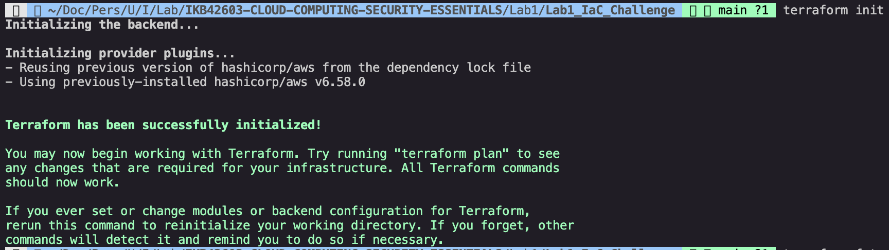
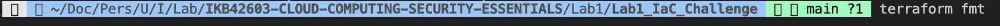
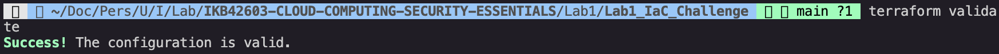
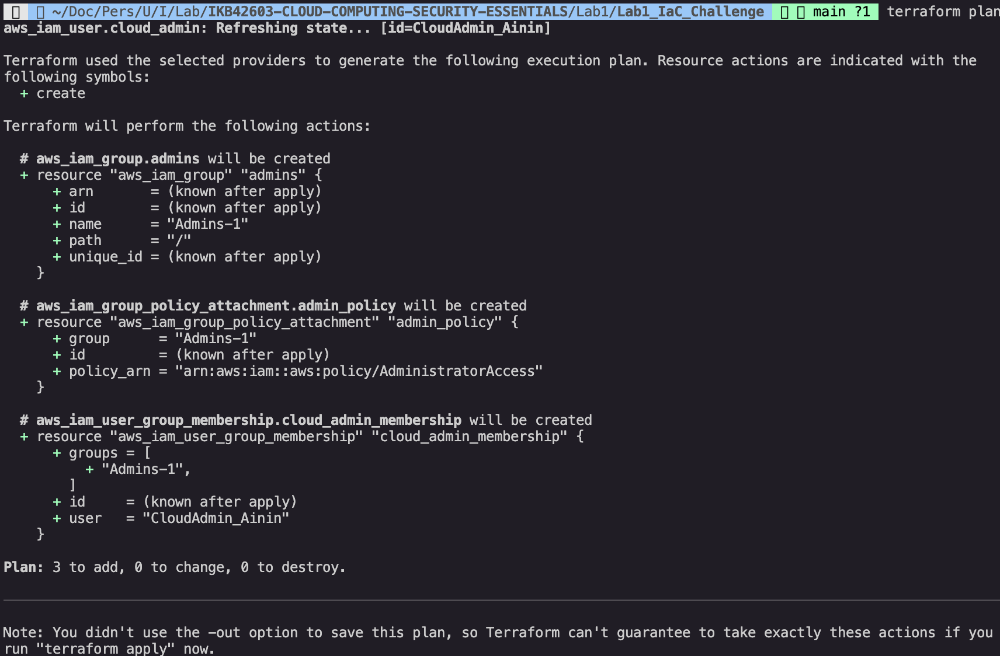
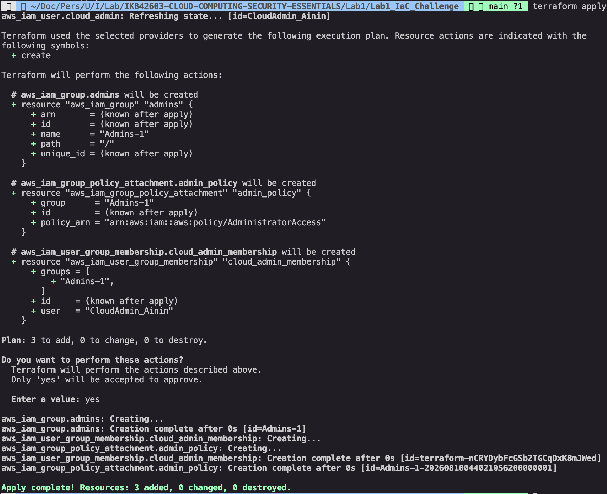
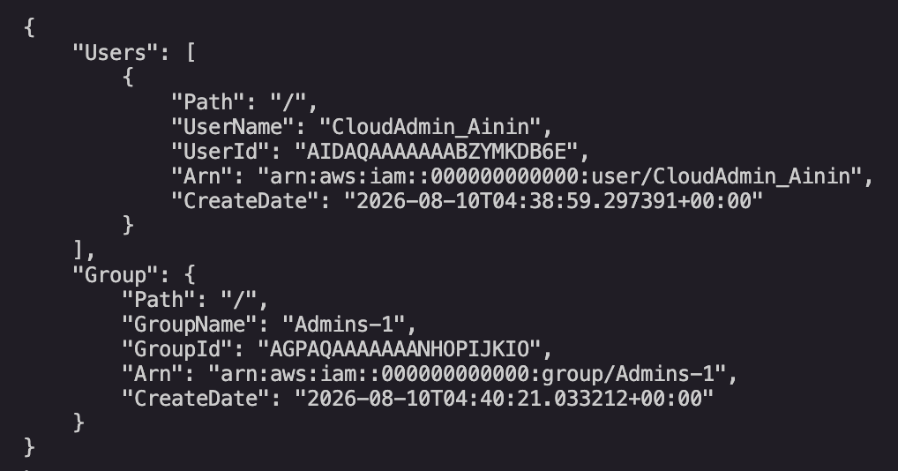

# Lab 1: Infrastructure as Code Challenge

**Course:** IKB42603 Cloud Computing Security Essentials  
**Lab:** Lab 1 - IaC Challenge  
**Topic:** Terraform, LocalStack and IAM automation  
**Name:** Student name
**Environment:** Terraform with AWS provider pointed to LocalStack on `localhost:4566`

## Lab Summary

This challenge converts the manual IAM setup from Lab 1 into Infrastructure as Code using Terraform. Instead of creating the IAM group, policy attachment, user and group membership manually with AWS CLI commands, the resources are declared in `main.tf` and applied automatically through Terraform.

The Terraform configuration uses the AWS provider, but the provider endpoint is redirected to LocalStack. This means the IAM resources are created in the local simulated AWS environment instead of a real AWS account.

## Evidence Folder

All screenshots used for this IaC challenge are stored in the `Evidence` folder.

| Evidence File | Purpose |
|---|---|
| `1-terraform-init.png` | Terraform initialization and provider setup |
| `2-terraform-fmt.png` | Terraform formatting check or formatting command |
| `3-terraform-validate.png` | Terraform configuration validation |
| `4-terraform-plan.png` | Terraform execution plan showing resources to be created |
| `5-terraform-apply.png` | Terraform apply result showing resources created successfully |

## Terraform Configuration

The Terraform file used for this challenge is:

```text
main.tf
```

The configuration begins by declaring the required AWS provider:

```hcl
terraform {
  required_providers {
    aws = {
      source = "hashicorp/aws"
    }
  }
}
```

The AWS provider is then configured to use LocalStack:

```hcl
provider "aws" {
  access_key = "test"
  secret_key = "test"
  region     = "us-east-1"

  endpoints {
    iam = "http://localhost:4566"
    sts = "http://localhost:4566"
  }

  skip_credentials_validation = true
  skip_metadata_api_check     = true
  skip_requesting_account_id  = true
}
```

The dummy access key and secret key are used because LocalStack does not require real AWS credentials. The IAM and STS endpoints are set to `http://localhost:4566`, which is the default LocalStack edge endpoint.

## Resources Created

The `main.tf` file creates four Terraform-managed IAM resources.

| Terraform Resource | Resource Type | Created Object |
|---|---|---|
| `aws_iam_group.admins` | IAM Group | `Admins-1` |
| `aws_iam_group_policy_attachment.admin_policy` | Group policy attachment | `AdministratorAccess` attached to `Admins-1` |
| `aws_iam_user.cloud_admin` | IAM User | `CloudAdmin_Ainin` |
| `aws_iam_user_group_membership.cloud_admin_membership` | User group membership | `CloudAdmin_Ainin` added to `Admins-1` |

## Step 1: Initialize Terraform

Command:

```bash
terraform init
```

This command initializes the Terraform working directory and downloads the required AWS provider. It also creates the `.terraform` directory and `.terraform.lock.hcl` dependency lock file.

Evidence:



## Step 2: Format Terraform Code

Command:

```bash
terraform fmt
```

This command formats the Terraform configuration file so that it follows Terraform's standard style.

Evidence:



## Step 3: Validate Terraform Configuration

Command:

```bash
terraform validate
```

This command checks whether the Terraform configuration is syntactically valid and internally consistent.

Evidence:



## Step 4: Review Terraform Plan

Command:

```bash
terraform plan
```

This command previews the actions Terraform will perform before making changes. The plan shows that Terraform will create the IAM group, attach the administrator policy, create the IAM user and add the user to the group.

Evidence:



## Step 5: Apply Terraform Configuration

Command:

```bash
terraform apply
```

After reviewing the plan, `terraform apply` was used to create the declared IAM resources in LocalStack. Terraform created the `Admins-1` group, attached the `AdministratorAccess` policy, created the `CloudAdmin_Ainin` user and added the user to the group.

Evidence:



## Verification

The Terraform state file confirms that the resources were created and are now managed by Terraform.

Created IAM group:

```text
arn:aws:iam::000000000000:group/Admins-1
```

Created IAM user:

```text
arn:aws:iam::000000000000:user/CloudAdmin_Ainin
```

The group policy attachment confirms that the `AdministratorAccess` managed policy is attached to the `Admins-1` group:

```text
arn:aws:iam::aws:policy/AdministratorAccess
```

The user group membership confirms that `CloudAdmin_Ainin` is a member of `Admins-1`.



## Cleanup

To remove the IAM resources created by Terraform, the following command can be used:

```bash
terraform destroy
```

This deletes only the Terraform-managed resources from LocalStack. It does not delete anything from a real AWS account because the provider is configured to use the local endpoint `http://localhost:4566`.

## Conclusion

The IaC challenge was completed successfully. Terraform was used to automate IAM resource provisioning in LocalStack, demonstrating how cloud identity resources can be managed consistently through code. The final configuration created an admin group, attached an administrator policy, created a personal admin user and assigned the user to the group.
