# Lab 3: Data Protection, Encryption and Key Management

**Course:** IKB42603 Cloud Computing Security Essentials  
**Lab:** Lab 3  
**Topic:** Data protection using encryption at rest, encryption in transit, KMS, envelope encryption, cryptographic erasure and integrity checking  
**Environment:** OpenSSL, Docker Nginx TLS container, AWS CLI with LocalStack KMS on `localhost:4566`  
**Name:** Student Name

## Lab Summary

This lab demonstrates how cloud data can be protected using encryption and sound key management. Session A covers encryption fundamentals using OpenSSL: AES symmetric encryption for data at rest, RSA asymmetric encryption, digital signatures and TLS for data in transit. Session B extends the same ideas into cloud-style key management using LocalStack KMS, customer master keys, envelope encryption, per-tenant keys and cryptographic erasure.

The lab also verifies integrity controls using SHA-256 hashing and a simple hash chain. The main security lesson is that encryption algorithms are only one part of the control; the real operational risk is how keys are generated, stored, distributed, rotated and destroyed.

## Evidence Folder

All screenshots used for this report are stored in the `Evidence` folder.

| Evidence File | Purpose |
|---|---|
| `1-Enc.png` | AES-256-CBC encryption, encrypted file output and successful decryption match |
| `2-Asy.png` | RSA key generation, public-key encryption, private-key decryption and signature verification |
| `3.1-TLS.png` | Self-signed TLS certificate/key generation |
| `3.2-redo.png` | TLS container setup redo using the Lab3 files |
| `3.3-curl.png` | `curl -k https://localhost:8443/record.txt` output over TLS |
| `4-CMK.png` | Tenant A KMS customer master key creation |
| `4.1-encrypt-KMS.png` | Direct KMS encryption of a small plaintext value |
| `5.1-kms.png` | KMS data key generation for envelope encryption |
| `5.1.a-column.png` | Plaintext and wrapped data key values separated into files |
| `5.2-encrypt-big.png` | Local encryption using the plaintext data key |
| `5.3-destroy.png` | Plaintext data key removed from disk |
| `6-KeyB.png` | Tenant B KMS customer master key creation |
| `6.2-schedule.png` | Tenant A key scheduled for deletion |
| `6.3-unwrap.png` | Failed attempt to unwrap Tenant A's data key after erasure |
| `7-integrity.png` | SHA-256 hashes, tamper detection and hash-chain output |

## Session A: Encryption Fundamentals

## Task 1: Symmetric Encryption for Data at Rest

A sensitive record was created:

```bash
echo 'Patient: Ahmad, Diagnosis: confidential' > record.txt
```

The file was encrypted using AES-256-CBC with PBKDF2 and salt:

```bash
openssl enc -aes-256-cbc -pbkdf2 -salt -in record.txt -out record.enc
```

The encrypted file was checked with `cat record.enc`. The output appeared unreadable, proving that the plaintext was no longer directly visible from the encrypted file.

The file was then decrypted:

```bash
openssl enc -d -aes-256-cbc -pbkdf2 -in record.enc -out record.dec.txt
diff record.txt record.dec.txt && echo 'MATCH: decryption successful'
```

Observed result:

```text
MATCH: decryption successful
```

The original file and decrypted file both contain:

```text
Patient: Ahmad, Diagnosis: confidential
```

Result:

AES encryption protected the record at rest, and the successful `diff` confirmed that the data could be recovered only with the correct passphrase/key.

Evidence:

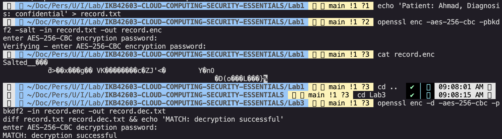

## Task 2: Asymmetric Encryption and Digital Signatures

An RSA key pair was generated:

```bash
openssl genrsa -out private.pem 2048
openssl rsa -in private.pem -pubout -out public.pem
```

The public key was used to encrypt the record, and the private key was used to decrypt it:

```bash
openssl pkeyutl -encrypt -pubin -inkey public.pem -in record.txt -out record.rsa
openssl pkeyutl -decrypt -inkey private.pem -in record.rsa -out record.rsa.txt
```

The private key was then used to sign the original record, and the public key was used to verify the signature:

```bash
openssl dgst -sha256 -sign private.pem -out record.sig record.txt
openssl dgst -sha256 -verify public.pem -signature record.sig record.txt
```

Observed result:

```text
Verified OK
```

Result:

The RSA encryption test showed confidentiality using a public/private key pair. The signature verification showed integrity and origin: the file matched the signature created by the private key.

Evidence:

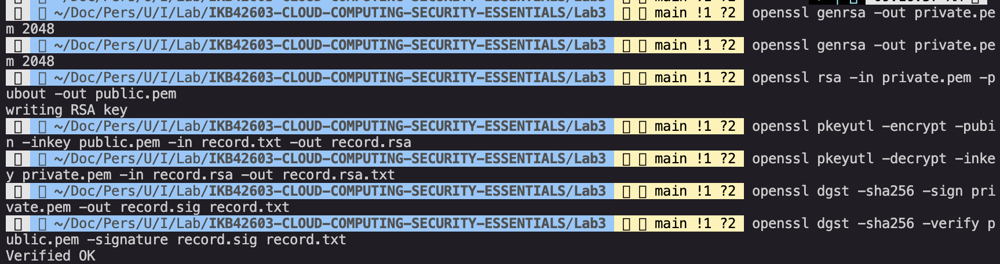

## Task 3: Encryption in Transit with TLS

A self-signed certificate and private key were generated for `localhost`:

```bash
openssl req -x509 -newkey rsa:2048 -keyout key.pem -out cert.pem \
  -days 7 -nodes -subj '/CN=localhost'
```

An Nginx container was used to serve `record.txt` over HTTPS on port `8443`:

```bash
docker run --rm -d --name tls -p 8443:443 \
  -v $(pwd)/cert.pem:/etc/nginx/cert.pem \
  -v $(pwd)/key.pem:/etc/nginx/key.pem \
  -v $(pwd)/record.txt:/usr/share/nginx/html/record.txt nginx
```

The file was requested over TLS:

```bash
curl -k https://localhost:8443/record.txt
```

Observed output:

```text
Patient: Ahmad, Diagnosis: confidential
```

Result:

The record was successfully retrieved over HTTPS. The `-k` option was required because the certificate was self-signed. Compared with plain HTTP, TLS protects the record from being readable by an on-path attacker.

Evidence:

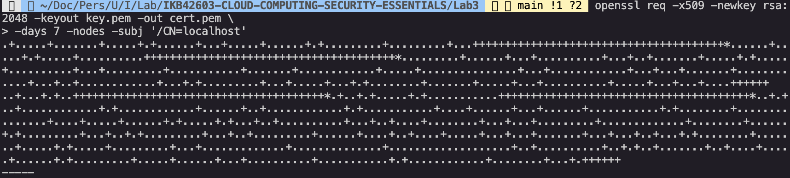

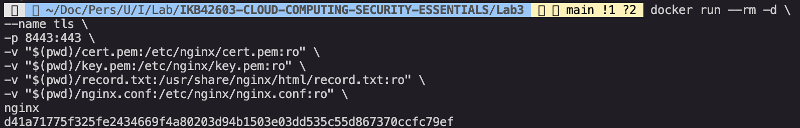

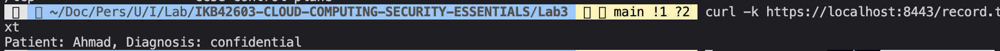

## Session B: KMS, Envelope Encryption and Erasure

## Task 4: Create and Use a KMS Master Key

The AWS CLI was pointed to LocalStack:

```bash
EP='--endpoint-url=http://localhost:4566'
```

A customer master key was created for Tenant A:

```bash
aws $EP kms create-key --description 'CCSE tenant-A master key'
```

Observed Tenant A KeyId:

```text
2bb776f2-1a79-4500-9d72-657cfeeb98d3
```

The key was then used to encrypt a small plaintext value directly through KMS:

```bash
aws $EP kms encrypt --key-id $KEY_A --plaintext "$(echo -n 'hello' | base64)" \
  --query CiphertextBlob --output text
```

Result:

LocalStack KMS created a customer-managed symmetric key for Tenant A. Direct KMS encryption worked for a small value, but this approach is not suitable for large data objects.

Evidence:

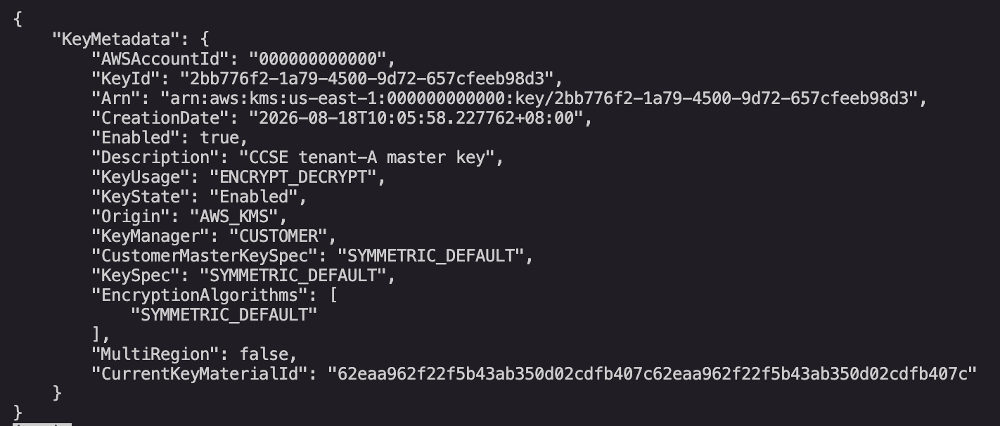


## Task 5: Envelope Encryption

KMS was used to generate a data key under Tenant A's master key:

```bash
aws $EP kms generate-data-key --key-id $KEY_A --key-spec AES_256 \
  --query '[Plaintext,CiphertextBlob]' --output text
```

The command returned two values:

- `Plaintext`: the temporary data key used locally for encryption.
- `CiphertextBlob`: the same data key wrapped by KMS under Tenant A's master key.

The plaintext data key was decoded and used to encrypt the record locally:

```bash
base64 -d datakey.b64 > datakey.bin
openssl enc -aes-256-cbc -pbkdf2 -in record.txt -out record.env.enc \
  -pass file:./datakey.bin
```

After encryption, the plaintext data key was deleted:

```bash
rm datakey.bin datakey.b64
echo 'Only the KMS-wrapped data key (datakey.enc) remains.'
```

Observed local artifacts:

```text
record.env.enc     encrypted data file
datakey.enc        KMS-wrapped data key
```

Result:

Envelope encryption was implemented correctly. The large data was encrypted locally using a data key, while KMS protected only the small data key. This reduces KMS workload and keeps the master key inside the key-management boundary.

Evidence:

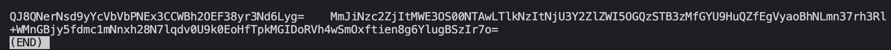

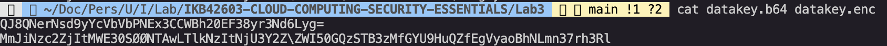

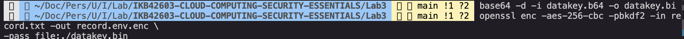

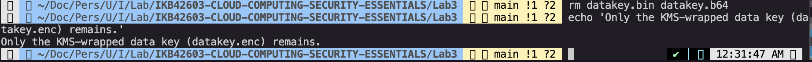

## Task 6: Per-Tenant Keys and Cryptographic Erasure

A separate KMS key was created for Tenant B:

```bash
aws $EP kms create-key --description 'CCSE tenant-B master key'
```

Observed Tenant B KeyId:

```text
3ba8637a-b02b-45cb-865a-d3538a7b41cd
```

Tenant A's key was then scheduled for deletion:

```bash
aws $EP kms schedule-key-deletion --key-id $KEY_A --pending-window-in-days 7
```

Observed deletion state:

```text
KeyId: 2bb776f2-1a79-4500-9d72-657cfeeb98d3
KeyState: PendingDeletion
PendingWindowInDays: 7
DeletionDate: 2026-08-26T00:36:21.936992+08:00
```

After the key became unavailable, an attempt was made to unwrap Tenant A's data key:

```bash
aws $EP kms decrypt --ciphertext-blob fileb://datakey.enc 2>&1 | head -3
```

Observed result:

```text
aws: [ERROR]: An error occurred (NotFoundException) when calling the Decrypt operation: Invalid keyId
```

Result:

The KMS decrypt operation failed, so the wrapped data key could not be recovered. Without the unwrapped data key, `record.env.enc` remains unreadable. This demonstrates cryptographic erasure: destroying or disabling the key makes the encrypted data unrecoverable even if the ciphertext still exists.

Evidence:

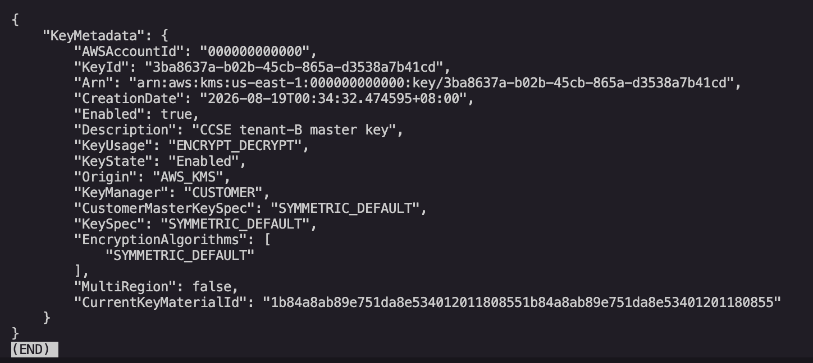

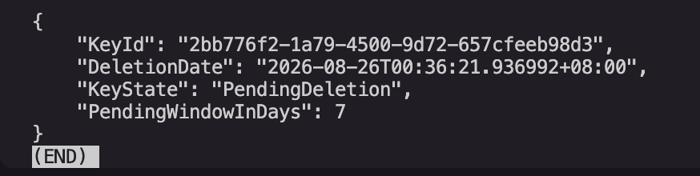

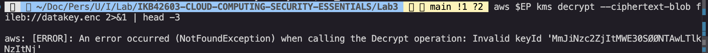

## Task 7: Integrity and Tamper-Evidence

The SHA-256 hash of the original record was calculated:

```bash
sha256sum record.txt
```

Observed hash:

```text
9345a32351cc1ad03e8b318059b753da6cd4e325688da97a01599b32bc945dd5  record.txt
```

A tampered copy was created and compared with the original:

```bash
cp record.txt tampered.txt
echo 'x' >> tampered.txt
sha256sum record.txt tampered.txt
```

Observed hashes:

```text
9345a32351cc1ad03e8b318059b753da6cd4e325688da97a01599b32bc945dd5  record.txt
8c8afc8a3e34425ab38ef90213102c638a82f756bd7187a03b306c5683065eb7  tampered.txt
```

A simple hash chain was then generated:

```bash
PREV=0
for line in 'login ok' 'file read' 'export data'; do
  PREV=$(echo -n "$PREV$line" | sha256sum | cut -d' ' -f1)
  echo "$line | $PREV"
done
```

Observed chain:

```text
login ok | 6795e7142224c8d096a573cede12266e4bca3a27c26f98999c24262bf84316c0
file read | 9d59cd795bcc3f41970f511076f8bf3dcfc2128d09ed05e7c89c8ff038c37bf8
export data | 5a133eb78358ac68fadb9d9e5956d65b3b38f235de983b02f54d1dad9f32194b
```

Result:

The tampered file produced a different hash, proving that hashing detects changes to data. The hash chain makes each log entry depend on the previous hash, so changing an earlier record would also change every later hash.

Evidence:

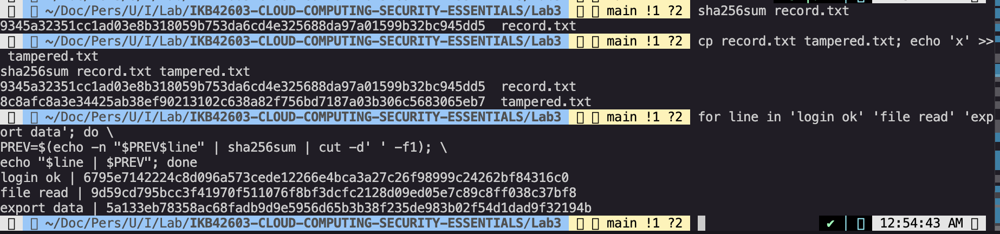

## Verification Commands

The lab guide requires these verification commands:

```bash
aws --endpoint-url=http://localhost:4566 kms list-keys
openssl dgst -sha256 -verify public.pem -signature record.sig record.txt
```

The local OpenSSL verification produced:

```text
Verified OK
```

## Short-Answer Questions

### Q1. Compare symmetric and asymmetric encryption: speed, key distribution, and typical use.

Symmetric encryption uses one shared secret key for both encryption and decryption. It is fast and suitable for encrypting large files, disks, databases and object storage data. Its main weakness is key distribution: every party that needs to decrypt the data must receive and protect the same secret key.

Asymmetric encryption uses a public/private key pair. It is slower, but it solves the distribution problem because the public key can be shared openly while the private key remains protected. It is commonly used for TLS, digital signatures, certificates, key exchange and encrypting small secrets.

### Q2. Why is key management described as the weakest link, not the algorithm?

Modern algorithms such as AES and RSA are usually strong when configured correctly. The weaker point is often the key lifecycle: where keys are stored, who can access them, whether they are rotated, whether plaintext keys are left on disk, and whether old keys are destroyed correctly. If an attacker steals the key, the strength of the encryption algorithm no longer protects the data.

### Q3. Explain envelope encryption and why only the master key needs hardware-grade protection.

Envelope encryption uses a data key to encrypt the actual data and a master key to encrypt, or wrap, the data key. The master key stays inside KMS, while the wrapped data key can be stored beside the encrypted data. Only the master key needs hardware-grade protection because it is the root of trust that unwraps many data keys. The data keys are short-lived in plaintext and should be discarded immediately after use.

### Q4. How does cryptographic erasure achieve provable deletion where overwriting cannot in the cloud?

In cloud storage, customers often cannot guarantee that every physical copy, replica, snapshot or cached block has been overwritten. Cryptographic erasure avoids this problem by destroying the key needed to decrypt the data. The encrypted bytes may still exist, but without the key they are computationally unreadable, which makes deletion enforceable at the cryptographic level.

### Q5. How does a hash chain make a log tamper-evident?

A hash chain stores each entry's hash as a function of both the current entry and the previous hash. This links the records together. If an attacker changes an earlier log entry, its hash changes, and every later hash in the chain no longer matches. This does not stop tampering by itself, but it makes tampering detectable during verification.

## Security Best-Practices Checklist

- [x] Data encrypted at rest using AES.
- [x] Decryption verified using `diff` and `MATCH: decryption successful`.
- [x] RSA public/private key pair used for asymmetric encryption.
- [x] Digital signature verified with `Verified OK`.
- [x] Data protected in transit using TLS.
- [x] KMS customer master keys created for separate tenants.
- [x] Envelope encryption used for local data encryption.
- [x] Plaintext data key removed from disk after use.
- [x] Cryptographic erasure demonstrated by failed data-key unwrap.
- [x] Integrity verified using SHA-256 hashing and a hash chain.

## Cleanup

After completing the lab and saving the evidence, the temporary services and files can be removed:

```bash
docker stop tls 2>/dev/null
rm -f record.* private.pem public.pem key.pem cert.pem datakey.* tampered.txt
docker stop localstack && docker rm localstack
```

## Conclusion

This lab showed how encryption protects data confidentiality at rest and in transit, while hashing and signatures protect integrity. It also showed why key management is central to cloud security. KMS and envelope encryption reduce direct exposure of master keys, per-tenant keys limit blast radius, and cryptographic erasure provides a practical way to make encrypted cloud data unrecoverable.
