# Lab 4: Access Control and Network Security

**Course:** IKB42603 Cloud Computing Security Essentials  
**Lab:** Lab 4  
**Topic:** Authentication, authorization, MFA, RBAC, network segmentation, firewall rules and container hardening  
**Environment:** Docker, Nginx, kind, kubectl, oathtool, iptables and Trivy  
**Name:** Student Name

## Lab Summary

This lab demonstrates the relationship between access control and network security in cloud-style environments. Session A focuses on identity controls: authentication with HTTP Basic authentication, MFA using TOTP, and authorization using Kubernetes RBAC. Session B focuses on limiting access after a workload is running: Docker network segmentation, default-deny firewall rules and container hardening.

The main security lesson is that no single control is enough. Authentication proves who is trying to access a service, authorization limits what that identity can do, segmentation limits what compromised services can reach, and hardening reduces the damage an attacker can cause inside a container.

## Evidence Folder

All screenshots used for this report are stored in the `Evidence` folder.

| Evidence File | Purpose |
|---|---|
| `1.1-alpine.png` | Password file generation with `httpd:alpine` and creation of the Nginx Basic Auth config |
| `1.2-authsvc.png` | Authenticated Nginx service container started as `authsvc` on port `8080` |
| `1.3-curl.png` | HTTP access test with no credentials and with valid credentials |
| `2-MFA:TOTH.png` | TOTP shared secret generation, current OTP code and successful `MFA OK` validation |
| `3.1-kind.png` | kind cluster, namespace and service account creation |
| `3.2-kubectl.png` | Kubernetes Role and RoleBinding creation |
| `3-RBAC.png` | RBAC authorization checks using `kubectl auth can-i` |
| `4.1-alpine.png` | Docker frontend/backend networks and three-tier containers created |
| `4.2-blocked.png` | Attempted `web` to `db` access resulted in `BLOCKED` |
| `4.3-reachable.png` | `app` to `db` access succeeded and printed `REACHABLE` |
| `5-fw.png` | iptables default-deny input policy with explicit allow rules |
| `6-Hardening.png` | Hardened container run and Docker inspect output |
| `6.1-Trivy.png` | Trivy image scan summary for `nginx:alpine` |

## Session A: Authentication and Authorization

## Task 1: Authentication with HTTP Basic Auth

A password file was generated for user `student` using the `httpd:alpine` image:

```bash
docker run --rm httpd:alpine htpasswd -nbB student 'P@ssw0rd!' > htpasswd.txt
```

An Nginx configuration was created to require HTTP Basic authentication:

```nginx
server { listen 80;
location / { auth_basic "Restricted";
auth_basic_user_file /etc/nginx/.htpasswd;
return 200 'Authenticated OK\n'; } }
```

The service was then started as `authsvc`:

```bash
docker run --rm -d --name authsvc -p 8080:80 \
  -v "$(pwd)/default.conf:/etc/nginx/conf.d/default.conf" \
  -v "$(pwd)/htpasswd.txt:/etc/nginx/.htpasswd" nginx
```

The evidence shows the authenticated request returned:

```text
Authenticated OK
```

Result:

The service was configured with a username/password file and valid credentials were accepted. However, the `1.3-curl.png` evidence shows `no-creds: 200`, while the lab expected unauthenticated access to return `401`. This indicates the test should be repeated with a corrected Nginx configuration so that the authentication check is enforced before returning the response.

Evidence:

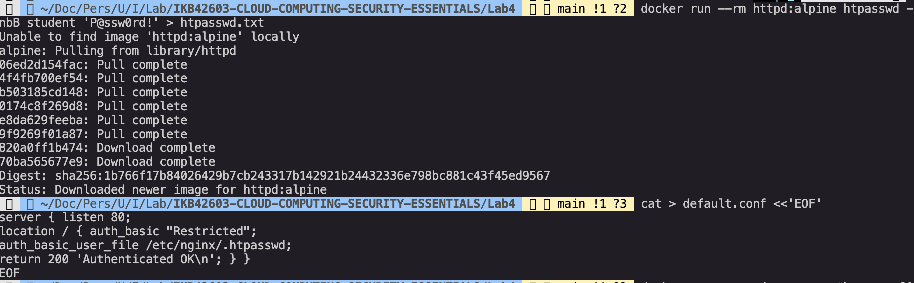

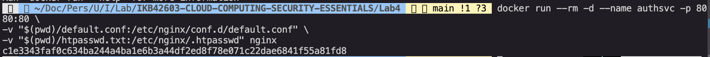

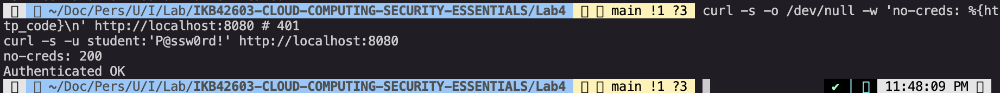

## Task 2: MFA with TOTP

A Base32 shared secret was generated using Python because `base32` was not available in the local shell:

```bash
SECRET=$(python3 -c 'import os,base64; print(base64.b32encode(os.urandom(20)).decode().rstrip("="))')
echo "Enrol this secret in an authenticator app: $SECRET"
oathtool --totp -b "$SECRET"
```

Observed secret:

```text
IEMZXYZ3C66RL73FISBBMAXEV2IVNOTZ
```

Observed TOTP code:

```text
875878
```

The user-entered code was compared with the current code generated by `oathtool`:

```bash
read "CODE?Enter the 6-digit code: "
[ "$CODE" = "$(oathtool --totp -b "$SECRET")" ] && echo 'MFA OK' || echo 'MFA FAILED'
```

Observed result:

```text
MFA OK
```

Result:

The valid one-time password was accepted. This demonstrates a second factor based on possession of the enrolled TOTP secret, reducing the risk of password-only compromise.

Evidence:

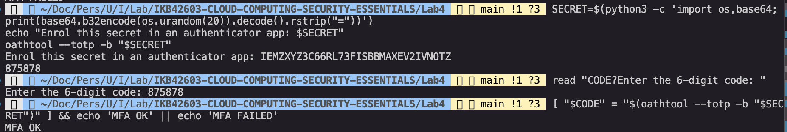

## Task 3: Authorization with Kubernetes RBAC

A kind cluster named `ccse-lab4` was created, followed by an `app` namespace and `dev` service account:

```bash
kind create cluster --name ccse-lab4
kubectl create namespace app
kubectl create serviceaccount dev -n app
```

Observed result:

```text
namespace/app created
serviceaccount/dev created
```

A least-privilege developer role was created to allow only `get` and `list` access to pods:

```bash
kubectl create role dev-role -n app --verb=get,list --resource=pods
kubectl create rolebinding dev-rb -n app --role=dev-role --serviceaccount=app:dev
```

Observed result:

```text
role.rbac.authorization.k8s.io/dev-role created
rolebinding.rbac.authorization.k8s.io/dev-rb created
```

Authorization checks were performed as the `dev` service account:

```bash
SA=system:serviceaccount:app:dev
kubectl auth can-i list pods -n app --as=$SA
kubectl auth can-i create deploy -n app --as=$SA
kubectl auth can-i delete pods -n app --as=$SA
```

Observed results:

```text
yes
no
no
```

Result:

RBAC allowed the developer identity to list pods, but denied deployment creation and pod deletion. This demonstrates authorization and least privilege: a valid identity still receives only the permissions required for its role.

Evidence:

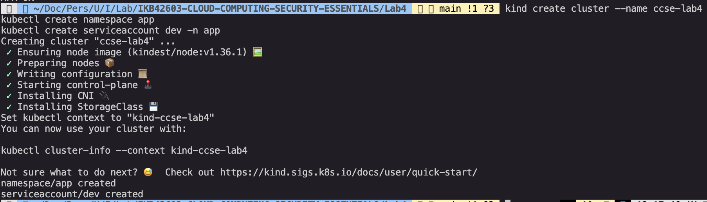

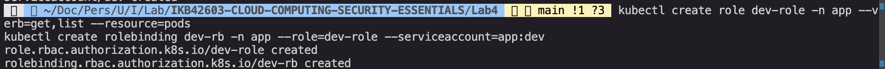

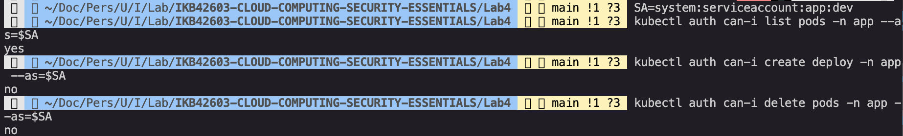

## Session B: Network Security and Hardening

## Task 4: Network Segmentation

Two Docker networks were created to model frontend and backend segments:

```bash
docker network create frontend-net
docker network create backend-net
```

Three containers were then deployed:

```bash
docker run -d --name db --network backend-net redis:alpine
docker run -d --name app --network backend-net nginx
docker network connect frontend-net app
docker run -d --name web --network frontend-net nginx
```

The architecture separates the database from the frontend:

```text
web  -> frontend-net only
app  -> frontend-net and backend-net
db   -> backend-net only
```

The `web` container attempted to reach the database and the evidence printed:

```text
BLOCKED
```

The `app` container then tested access to Redis on port `6379`:

```bash
docker exec app sh -c 'apt-get update -qq && apt-get install -y -qq netcat-openbsd && nc -z -w3 db 6379 && echo REACHABLE'
```

Observed result:

```text
Connection to db (172.23.0.2) 6379 port [tcp/*] succeeded!
REACHABLE
```

Result:

The application tier could reach the database because both shared `backend-net`. The frontend tier did not have a direct path to the database, which limits lateral movement if the public-facing web container is compromised.

Evidence note:

The `4.2-blocked.png` screenshot also shows `apk: not found` because the `web` container used the Debian-based `nginx` image, not Alpine. The output still printed `BLOCKED`, but a cleaner retest would use `apt-get` or an image that already contains `curl`/`nc` to prove the block is caused only by network segmentation.

Evidence:

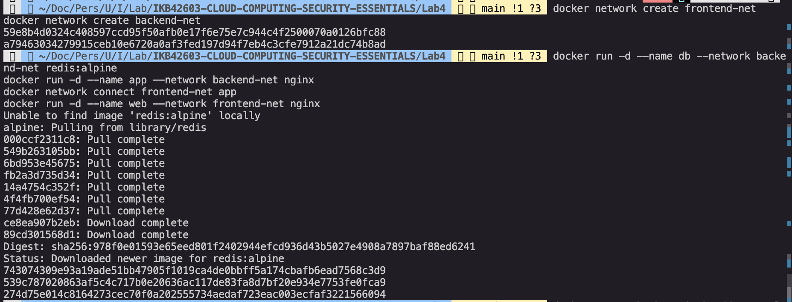

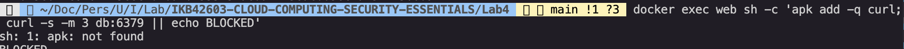

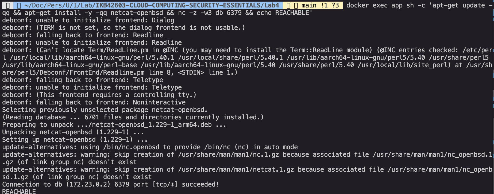

## Task 5: Firewall Rules with Default-Deny

A temporary Alpine container was run with `NET_ADMIN` so iptables rules could be configured:

```bash
docker run --rm --cap-add=NET_ADMIN alpine sh -c '\
  apk add -q iptables; \
  iptables -P INPUT DROP; \
  iptables -A INPUT -p tcp --dport 443 -j ACCEPT; \
  iptables -A INPUT -i lo -j ACCEPT; \
  iptables -L INPUT -n'
```

Observed firewall policy:

```text
Chain INPUT (policy DROP)
target  prot  opt  source     destination
ACCEPT  tcp   --   0.0.0.0/0  0.0.0.0/0  tcp dpt:443
ACCEPT  all   --   0.0.0.0/0  0.0.0.0/0
```

Result:

The input chain default policy was set to `DROP`, with explicit exceptions for HTTPS traffic on port `443` and loopback traffic. This mirrors the cloud security group model where no inbound traffic is allowed unless it is intentionally permitted.

Evidence:

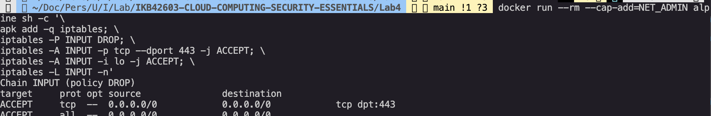

## Task 6: Container and Host Hardening

A hardened Nginx container was started with non-root execution, a read-only root filesystem, dropped Linux capabilities, no new privileges and a writable temporary filesystem:

```bash
docker run -d --name hardened \
  --user 1000:1000 \
  --read-only \
  --cap-drop=ALL \
  --security-opt no-new-privileges \
  --tmpfs /tmp \
  nginxinc/nginx-unprivileged
```

The container was inspected:

```bash
docker inspect hardened --format 'User={{.Config.User}} ReadOnly={{.HostConfig.ReadonlyRootfs}}'
```

Observed result:

```text
User=1000:1000
ReadOnly=true
```

The `nginx:alpine` image was scanned with Trivy for high and critical vulnerabilities:

```bash
docker run --rm aquasec/trivy image --severity HIGH,CRITICAL nginx:alpine | head -20
```

Observed Trivy summary:

```text
Target: nginx:alpine (alpine 3.24.1)
Type: alpine
Vulnerabilities: 0
```

Result:

The hardened container reduced runtime privilege and file-system write access. The Trivy scan reported no high or critical vulnerabilities for the scanned `nginx:alpine` target at the time of the lab.

Evidence:

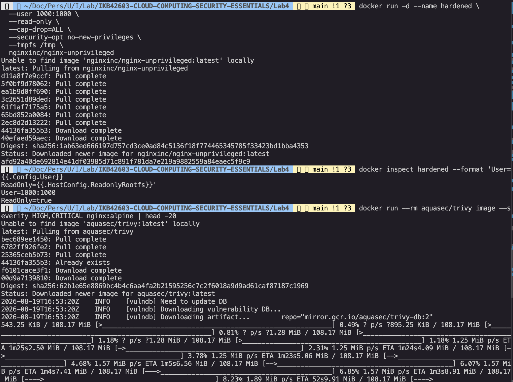

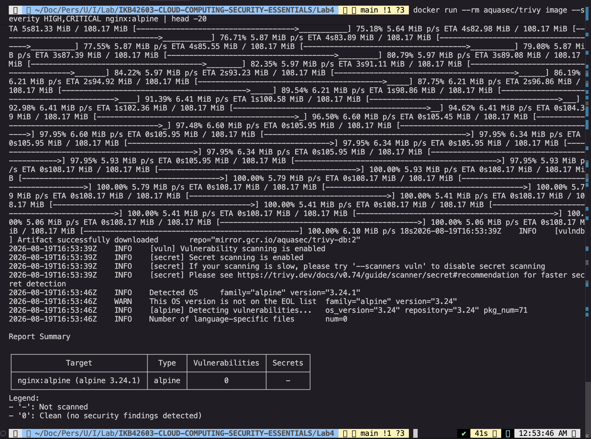

## Verification Commands

The lab guide required the following verification commands:

```bash
kubectl get rolebinding dev-rb -n app -o yaml
docker inspect hardened --format '{{json .HostConfig.CapDrop}}'
```

Expected verification meaning:

- `kubectl get rolebinding dev-rb -n app -o yaml` should show that the `dev-rb` RoleBinding binds the `dev-role` Role to the `app:dev` service account.
- `docker inspect hardened --format '{{json .HostConfig.CapDrop}}'` should show that all capabilities were dropped, expected as `["ALL"]`.

## Evidence Notes and Retest Items

Two evidence items should be retested before final submission if strict marking requires exact expected outputs:

- Task 1 expected unauthenticated access to return `401`, but the screenshot shows `no-creds: 200`. The Nginx config should be adjusted so Basic Auth protects the response, then the `curl` test should be repeated.
- Task 4 expected `web` to `db` to fail because of network isolation. The screenshot prints `BLOCKED`, but also shows `apk: not found`. A cleaner test should use the correct package manager or a diagnostic image with `curl`/`nc` already installed.

## Short-Answer Questions

### Q1. Explain the difference between authentication and authorization using Tasks 1 and 3.

Authentication verifies identity. In Task 1, the service checks whether the requester knows the valid username and password for `student`. Authorization decides what an authenticated identity is allowed to do. In Task 3, the `dev` service account exists as an identity, but Kubernetes RBAC allows it only to list pods and denies higher-risk actions such as creating deployments or deleting pods.

### Q2. Why is MFA so effective, and which attacks does it defeat?

MFA is effective because it requires more than a password. Even if an attacker steals or guesses the password, they still need the current one-time code generated from the enrolled TOTP secret. This helps defeat credential stuffing, password reuse, phishing attempts that capture only static passwords, brute-force password attacks and attacks using leaked password databases.

### Q3. How does network segmentation limit the damage of a compromised web server?

Network segmentation limits what a compromised service can reach. In this lab, the `web` container is attached only to `frontend-net`, while the database is attached only to `backend-net`. If the web tier is compromised, the attacker does not automatically gain direct network access to the database. The application tier becomes the controlled path between the frontend and the data tier.

### Q4. What does a default-deny firewall policy achieve, and how does it relate to cloud security groups?

A default-deny policy blocks all inbound traffic unless a specific allow rule exists. This reduces accidental exposure because new or forgotten services are not reachable by default. Cloud security groups use the same idea: administrators explicitly permit required ports, protocols and sources, while everything else remains denied.

### Q5. List the hardening measures you applied and the attack surface each one removes.

| Hardening Measure | Attack Surface Reduced |
|---|---|
| `--user 1000:1000` | Prevents the service from running as root, reducing the impact of container escape attempts or file permission abuse |
| `--read-only` | Prevents persistent writes to the root filesystem, limiting malware drops, file tampering and unauthorized configuration changes |
| `--cap-drop=ALL` | Removes Linux capabilities that are not needed by the workload, reducing kernel-level privilege abuse |
| `--security-opt no-new-privileges` | Prevents processes from gaining additional privileges through setuid binaries or similar mechanisms |
| `--tmpfs /tmp` | Provides temporary writable space without making the root filesystem writable |
| Trivy scanning | Detects known vulnerabilities before the image is trusted for deployment |

## Security Best-Practices Checklist

- [ ] Service requires authentication and unauthenticated requests are rejected. Retest required because current evidence shows `no-creds: 200`.
- [x] MFA / second factor implemented and validated with `MFA OK`.
- [x] Authorization enforced by RBAC using least privilege.
- [x] Unauthorized RBAC actions denied for deployment creation and pod deletion.
- [x] Network segmented so the data tier is not directly reachable from the frontend tier.
- [x] Backend application tier can reach the database through the approved network path.
- [x] Default-deny firewall policy configured with explicit allow rules.
- [x] Container hardened using non-root user, read-only filesystem, dropped capabilities and no-new-privileges.
- [x] Image scanned with Trivy for high and critical vulnerabilities.

## Cleanup

After completing the lab and saving evidence, the temporary resources can be removed:

```bash
docker rm -f authsvc db app web hardened 2>/dev/null
docker network rm frontend-net backend-net 2>/dev/null
kind delete cluster --name ccse-lab4
```

## Conclusion

This lab showed how access control and network security work together. Authentication and MFA reduce the chance of unauthorized login, RBAC limits what an identity can do, segmentation limits which services can communicate, firewall rules enforce explicit network access and container hardening reduces runtime attack surface. Together, these controls support least privilege across identity, network and compute layers.
