# Lab 6: Object Storage Security and the Data Security Lifecycle

**Course:** IKB42603 Cloud Computing Security Essentials  
**Sessions:** Weeks 11–12  
**Environment:** Docker, LocalStack Community, AWS CLI, Amazon S3 and AWS KMS emulation, curl  
**Bucket:** `miit-patient-records-27845`  
**Account:** `000000000000`  
**Region:** `us-east-1`

## 1. Introduction and Objectives

This lab examines the security of a simulated hospital records bucket throughout the data lifecycle: classification, storage, access, sharing, retention and deletion. The exercises demonstrate how an overly broad bucket policy exposes confidential information, how identity and resource policies interact, and how encryption and versioning affect data protection.

The objectives are to classify stored objects, reproduce and analyse anonymous exposure, configure Block Public Access and scoped policies, apply default SSE-KMS encryption, explain presigned access and transport conditions, and investigate versioning, lifecycle rules and cryptographic erasure.

This report follows the supplied *IKB42603 Lab 6: Object Storage Security & the Data Security Lifecycle* manual. Observations are based on the screenshots in `Evidence/`. Expected behaviour and procedures without supporting output are explicitly identified; the report does not claim those tests succeeded.

## 2. Environment Setup

The setup evidence shows a healthy container using `localstack/localstack:latest`, with port `4566` exposed. The CLI was configured for `http://localhost:4566`, dummy credentials and `us-east-1`. The successful identity response was:

```json
{
  "UserId": "000000000000",
  "Account": "000000000000",
  "Arn": "arn:aws:iam::000000000000:root"
}
```

An earlier endpoint connection error appears above the successful setup. The later identity output confirms that connectivity was established. The screenshot does not show the container launch configuration, so it does not establish whether `ENFORCE_IAM=1` was active.

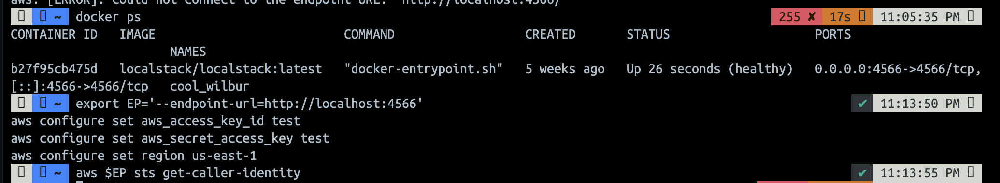

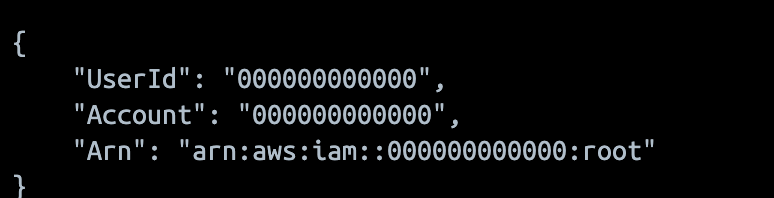

## 3. Session A: Object Storage and Access Security

### Task 1 — Classify the Data Before Storage

The bucket was created successfully, and three sample objects were stored under classification-oriented prefixes.

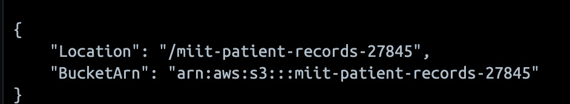

| Classification | Who may read it | Impact if leaked | Control applied or documented in this lab |
|---|---|---|---|
| Public | Visitors and other intended recipients of the notice | Low confidentiality impact; unauthorised changes could still mislead visitors | Separate `public/` prefix; bucket-level Block Public Access configured to avoid exposing unrelated records |
| Internal | Authorised hospital staff and the designated analyst | Disclosure of staff schedules and operational information | `internal/` prefix, a prepared scoped read policy and a generated 60-second presigned URL; access enforcement remains unverified |
| Confidential | Specifically authorised clinical personnel; the analyst is excluded | Disclosure of patient identity and medical information | Explicit analyst deny policy submitted for `confidential/*`; default SSE-KMS verified for the later upload; versioning enabled |

The object listing contained:

```text
confidential/record.txt    48 bytes
internal/roster.txt        29 bytes
public/notice.txt          29 bytes
```

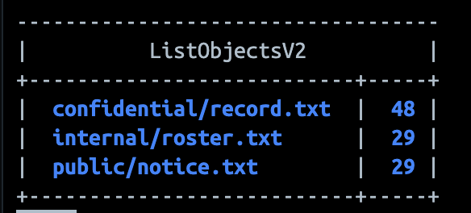

The manual specifies the tags `classification=public`, `classification=internal` and `classification=confidential`. The supplied screenshots do not show `get-object-tagging` output, so the exact tag values cannot be independently confirmed. Task 7 later reports `TagCount: 1` for the original confidential object, but does not identify that tag.

Object storage addresses objects through bucket names and keys, with API permissions governing access. Unlike block storage, it is not a raw disk exposed to an operating system; unlike a traditional file share, it does not rely on a directory tree and filesystem permissions. The slash in `confidential/record.txt` is part of the object key. Prefix-based permissions must therefore be scoped carefully.

### Task 2 — Reproduce the Public-Bucket Breach

The submitted resource policy allowed anyone to read every object:

```json
{
  "Version": "2012-10-17",
  "Statement": [{
    "Sid": "PublicReadEverything",
    "Effect": "Allow",
    "Principal": "*",
    "Action": "s3:GetObject",
    "Resource": "arn:aws:s3:::miit-patient-records-27845/*"
  }]
}
```

An anonymous `curl` request to the confidential object returned:

```text
HTTP 200
Patient: Ahmad bin Ali, Diagnosis: confidential
```

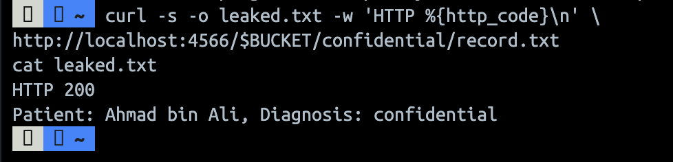

The exposure was caused by `"Principal": "*"` in an **Allow** statement, combined with `s3:GetObject` and the bucket-wide object resource. The wildcard includes anonymous callers. No stolen account or software exploit was needed: the bucket policy itself authorised the read.

### Task 3 — Block Public Access and Least Privilege

The public policy was removed and all four bucket-level Block Public Access settings were enabled:

```json
{
  "BlockPublicAcls": true,
  "IgnorePublicAcls": true,
  "BlockPublicPolicy": true,
  "RestrictPublicBuckets": true
}
```

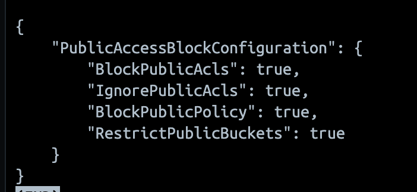

However, the public policy was then submitted again and the anonymous retest returned:

```text
anonymous read now: HTTP 200
```

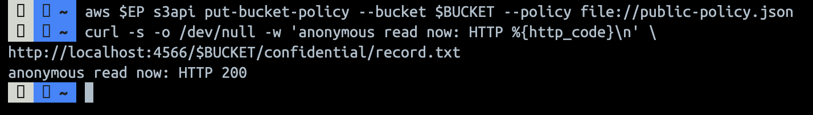

This demonstrates a difference between stored configuration and effective enforcement in this run, consistent with the manual's LocalStack caveat. On AWS, `BlockPublicPolicy` is the flag intended to reject the attempted public bucket policy. `BlockPublicAcls` rejects public ACLs, `IgnorePublicAcls` disregards public ACL permissions, and `RestrictPublicBuckets` restricts access to buckets with public policies. The command used here configures the **bucket**, rather than establishing account-wide settings.

A replacement policy was prepared with `AccountReadInternalOnly`, the account principal `arn:aws:iam::000000000000:root`, action `s3:GetObject`, and resource `arn:aws:s3:::miit-patient-records-27845/internal/*`.

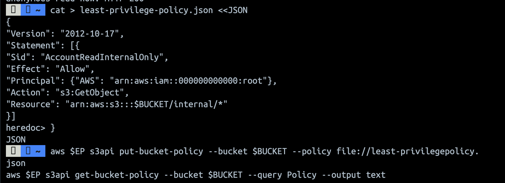

There is an evidence discrepancy: the file creation uses `least-privilege-policy.json`, whereas the displayed application command references `least-privilegepolicy.json`. Furthermore, the subsequent screenshot still displays `PublicReadEverything`. The evidence therefore does not establish successful installation of the scoped policy or successful closure of anonymous access at this stage.

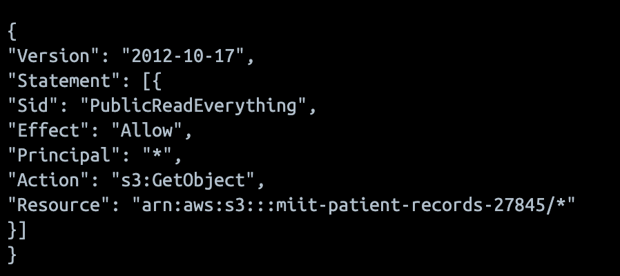

Block Public Access is a preventive guardrail: when enforced, it constrains future policy mistakes. A detective check merely reports exposure after it exists, leaving a window for information leakage.

### Task 4 — Identity Policy Versus Resource Policy

The IAM user `DataAnalyst` was created. Its inline `S3ReadAll` identity policy allows `s3:GetObject` and `s3:ListBucket` on `*`.

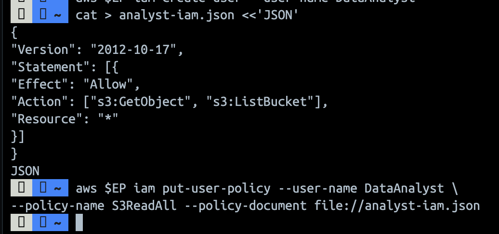

The bucket policy contains two statements:

| Statement | Effect | Scope |
|---|---|---|
| `AllowAnalystInternal` | Allow `s3:GetObject` | `DataAnalyst` accessing `internal/*` |
| `DenyAnalystConfidential` | Deny `s3:*` | `DataAnalyst` accessing `confidential/*` |

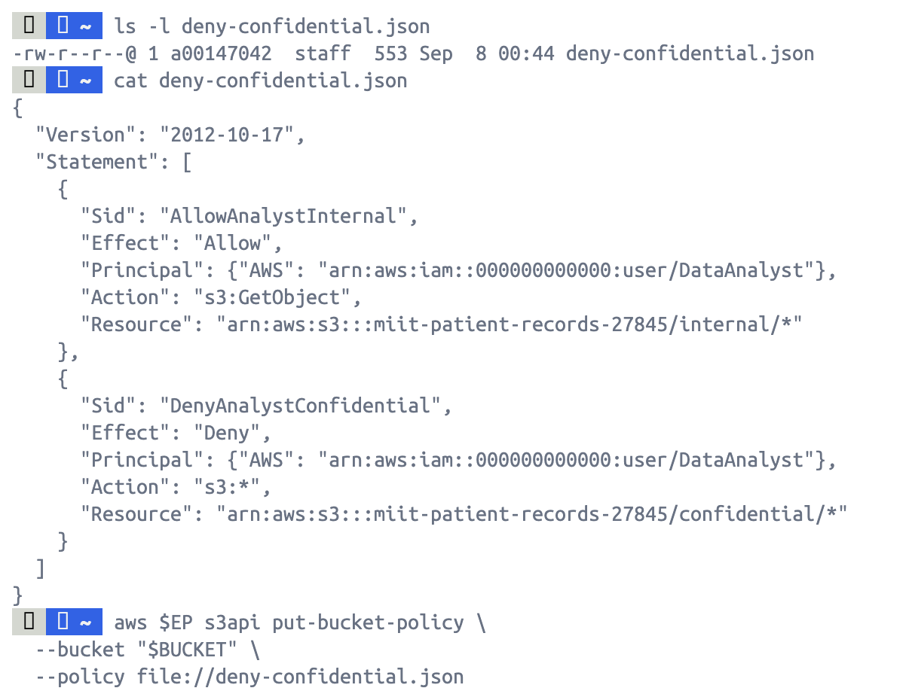

The screenshot shows the policy document and its submission without a displayed error. It does not show the analyst's two object-read attempts. The following is the written policy evaluation requested by the manual, **not captured execution output**:

| Request | Identity policy | Resource policy | Expected decision |
|---|---|---|---|
| Read `internal/roster.txt` | Allows `s3:GetObject` | `AllowAnalystInternal` allows it | Allowed, assuming no other applicable restriction |
| Read `confidential/record.txt` | Allows `s3:GetObject` | `DenyAnalystConfidential` explicitly denies it | Denied; the explicit Deny overrides the Allow |

Evaluation starts from implicit denial. Any applicable explicit Deny takes precedence; otherwise, an applicable Allow can authorise the request within the relevant policy boundaries. An Allow limited to `internal/*` alone would not cancel the analyst's broader identity permission for other objects. The explicit confidential Deny is what resolves that conflict.

## 4. Session B: Protection, Sharing and Data Retirement

### Task 5 — Default Encryption at Rest with SSE-KMS

A dedicated KMS key was created:

```text
f5d03d9b-a7d3-4424-b370-a36c3b59a7c2
```

The bucket encryption output shows `SSEAlgorithm: aws:kms`, this key ID and `BucketKeyEnabled: true`.

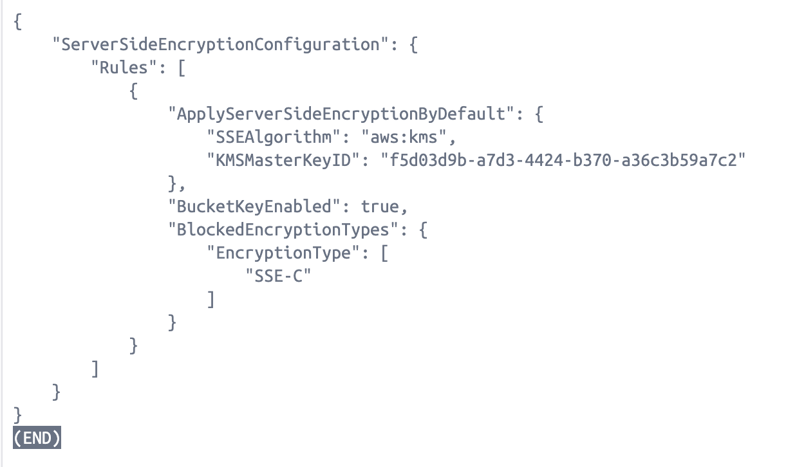

The upload response and subsequent `head-object` evidence confirm:

```text
ServerSideEncryption: aws:kms
SSEKMSKeyId: arn:aws:kms:us-east-1:000000000000:key/f5d03d9b-a7d3-4424-b370-a36c3b59a7c2
BucketKeyEnabled: True
```

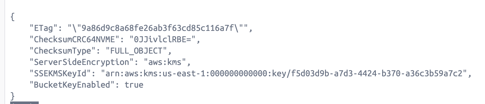


These results support the intended protection of the later `confidential/record-v2.txt` upload through the bucket default. S3 Bucket Keys reduce direct KMS request overhead through a bucket-level key mechanism.

Default encryption protects newly written objects at rest; it does not retroactively convert existing versions. This distinction is visible in Task 7, where the original version still reports `AES256`. Encryption also does not replace authorisation: a caller with the necessary S3 and KMS permissions can receive decrypted content. No separate upload policy requiring a particular encryption request header is evidenced.

### Task 6 — Presigned URLs and the Transport Condition

A URL was generated for `internal/roster.txt` using:

```bash
aws $EP s3 presign s3://$BUCKET/internal/roster.txt --expires-in 60
```

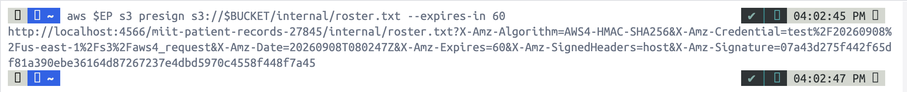

The URL contains `X-Amz-Algorithm=AWS4-HMAC-SHA256`, `X-Amz-Date=20260908T080247Z`, `X-Amz-Expires=60`, `X-Amz-SignedHeaders=host`, and `X-Amz-Signature`. The date and expiry define the intended validity interval. The signature authenticates the signed request, including its method, object path, query parameters and signed headers. Changing these signed components invalidates the signature when validation is enforced.

A holder can use the URL without a separate AWS identity, subject to the signer's permissions and applicable controls. The URL should therefore be treated as a temporary bearer credential. Expiry prevents subsequent authorised requests; it cannot revoke a copy already downloaded. No initial or post-expiry `curl` responses are supplied, so expiry enforcement was not demonstrated.

The manual's transport policy uses an explicit Deny when:

```json
"Condition": {"Bool": {"aws:SecureTransport": "false"}}
```

With `Principal: "*"`, `Action: "s3:*"` and both bucket and object resource ARNs, this condition is intended to reject insecure requests. The local endpoint uses HTTP, so its requests match the condition. With HTTPS, `aws:SecureTransport` is true and the condition testing for false does not match.

The provided Task 6 listing shows a successful object listing, rather than an access-denied response:

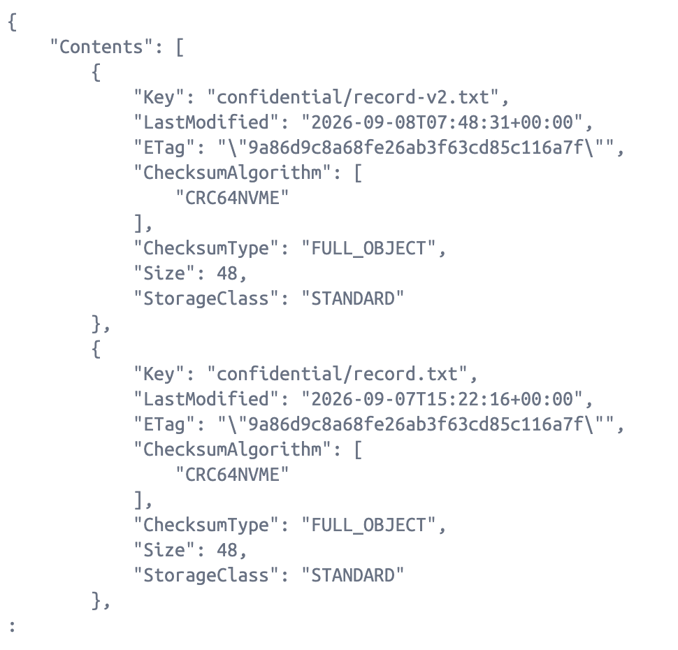

There is no screenshot of the transport policy being applied or of the resulting lockout. Therefore, the expected bucket-wide refusal cannot be reported as observed. A condition key must be evaluated against the actual endpoint and request context: a rule copied from an HTTPS environment can block legitimate work against an HTTP emulator.

### Task 7 — Versioning, Delete Markers and Data Remanence

Bucket versioning was enabled:

```json
{"Status": "Enabled"}
```

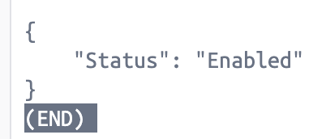

The version listing shows three stored versions: a latest 43-byte revision, an earlier 48-byte revision, and the original 48-byte `null` version created before versioning was enabled.

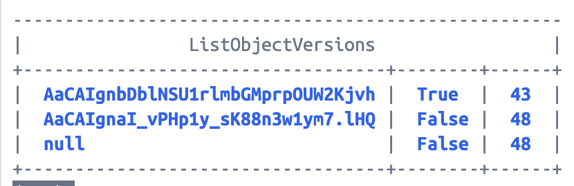

Deleting the object returned `DeleteMarker: true`. A subsequent listing marked that delete marker as the latest version.

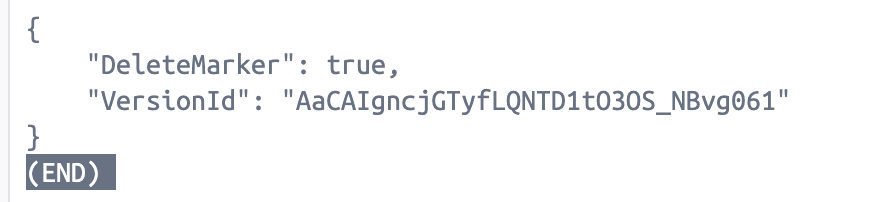

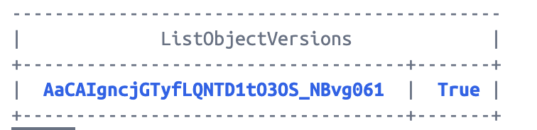

The recovery screenshot reports:

```text
VersionId: null
ContentLength: 48
ServerSideEncryption: AES256
TagCount: 1
```

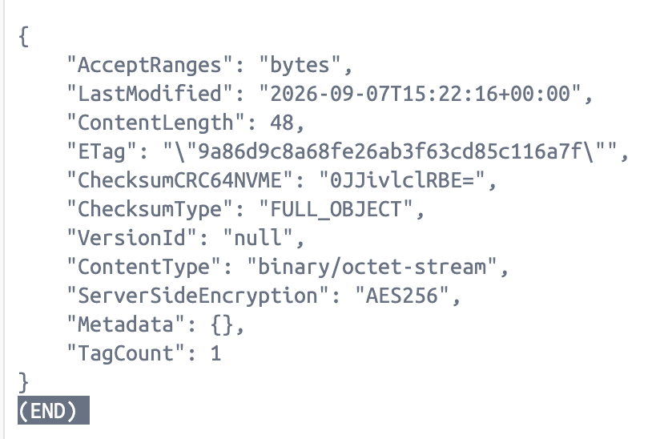

This supports recovery of the original stored version despite the delete marker. The screenshot contains response metadata, not `cat recovered.txt`, so it does not directly display the recovered plaintext. The original sample content is visible in Task 2. The expected ordinary-read failure after deletion is also not captured.

The final version listing contains only the two newer versions, consistent with removal of the `null` version:

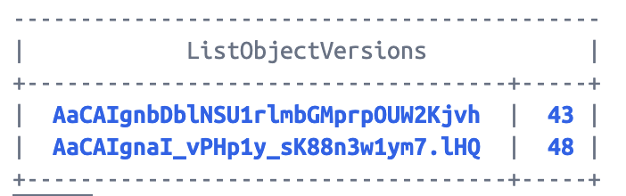

Removing one version does not establish complete erasure. Remaining versions, other keys such as `confidential/record-v2.txt`, and downloaded copies must also be considered. Versioning supports recovery from mistakes, but increases the work needed to verify data removal.

### Task 8 — Lifecycle, Retention and Cryptographic Erasure

**Evidence status:** No Task 8 screenshots were supplied. The following describes the manual's intended configuration and its interpretation; application and enforcement remain unverified.

| Lifecycle rule | Intended action | Purpose |
|---|---|---|
| `RetireConfidentialRecords` | Expire current objects under `confidential/` after 365 days | Express the lab's retention period |
| `RetireConfidentialRecords` | Expire noncurrent versions after 30 noncurrent days | Retire historical copies |
| `AbortIncompleteUploads` | Abort incomplete multipart uploads after 7 days | Remove abandoned upload parts |

In a versioned bucket, expiration of a current object normally introduces a delete marker. Noncurrent-version expiration addresses retained historical versions separately. These are lab retention values, not a determination of the retention period appropriate for actual hospital records. Lifecycle configuration output proves that rules are configured, not that asynchronous deletion has already occurred.

The manual next calls for disabling the dedicated KMS key, scheduling deletion with a seven-day waiting period, inspecting its state, and attempting a read of an object encrypted under that key. Expected key state after scheduling is `PendingDeletion`; this is not evidence that the key has already been permanently destroyed. Disabling a key is reversible, and scheduled deletion can be cancelled during the waiting period.

Cryptographic erasure depends on final destruction of the key material required to decrypt the affected ciphertext, with no usable alternative key or plaintext copy remaining. In this lab, the original version reports `AES256`, so deleting the later customer-managed KMS key would **not** erase that version. All relevant objects and versions must first be checked for encryption-key coverage. If LocalStack still permits an S3 read after key disablement, the manual requests a separate KMS encrypt/disable/decrypt demonstration; no such evidence is available here.

## 5. Short-Answer Questions

### Q1. Which policy element caused the exposure, and why is it more dangerous than an over-broad IAM policy on one user?

`"Principal": "*"` in the public **Allow** statement includes anonymous callers. Combined with `s3:GetObject` and `bucket/*`, it exposes every object. An over-broad identity policy grants excessive permissions to the identities carrying that policy; this bucket policy directly permits unauthenticated access to the resource.

### Q2. How do identity-based and resource-based policies differ, and which decided the analyst's requests?

An identity policy attaches permissions to a user, group or role. A resource policy attaches permissions to the bucket and names the principals covered. For the internal read, both `S3ReadAll` and `AllowAnalystInternal` permit access. For the confidential read, `DenyAnalystConfidential` overrides the identity Allow. These are the expected policy decisions; the screenshots do not contain the two read-test results.

### Q3. Why is Block Public Access a guardrail, and why does that matter with many engineers?

A guardrail is itself a preventive control that constrains other configuration choices. Enforced Block Public Access can prevent engineers from accidentally publishing a bucket through later policy or ACL changes. This is stronger than relying only on reviews or alerts after exposure. The lab demonstrates why enforcement must still be tested: all four flags were true, but the anonymous read returned HTTP 200.

### Q4. Does default SSE-KMS protect the confidential record from the analyst?

It does not independently replace the Task 4 denial. SSE-KMS encrypts stored data and requires appropriate KMS authorisation for decryption, but an authorised reader receives plaintext. The analyst's explicit S3 Deny remains decisive for the confidential read. Also, the original Task 1 record was stored before the KMS default was configured and its recovered metadata reports `AES256`; the later default does not change that version automatically.

### Q5. Why is delete-object alone insufficient for an erasure request, and what two mechanisms support provable deletion?

The Task 7 evidence shows a delete marker while the original version remains retrievable. An ordinary delete therefore does not establish that the underlying record was erased.

1. **Delete every relevant object version explicitly:** Remove the targeted versions and associated copies, account for replicas and backups, and retain deletion records plus version inventories and retrieval checks. An empty version inventory supports logical removal from the bucket, rather than proving physical-media overwrite.
2. **Cryptographic erasure:** Ensure every relevant copy is encrypted exclusively under the key being retired, permanently destroy that key material, and retain evidence of completed key destruction and failed decryption. Disabled or pending-deletion state alone does not prove irreversible destruction. The original AES256 version in this lab is outside the later KMS key's coverage.

### Q6. Which three commands would an auditor collect, and what does each evidence?

| Command | Control evidenced | Evidence limit |
|---|---|---|
| `aws $EP s3api get-public-access-block --bucket "$BUCKET"` | All four public-access guardrails configured | Pair with anonymous tests to verify enforcement |
| `aws $EP s3api head-object --bucket "$BUCKET" --key confidential/record-v2.txt` | Encryption algorithm and key for a specific object | Does not establish encryption of all older versions |
| `aws $EP s3api get-bucket-lifecycle-configuration --bucket "$BUCKET"` | Documented retention and noncurrent-version expiration rules | Output is missing here; configuration alone does not prove completed deletion |

## 6. Final Verification and Evidence Gaps

The manual requires a combined verification output. That output is not present in the supplied evidence. The following read-only commands can collect it from the original running lab environment; they were not executed for this report:

```bash
export EP='--endpoint-url=http://localhost:4566'
export BUCKET='miit-patient-records-27845'
export KEY_ID='f5d03d9b-a7d3-4424-b370-a36c3b59a7c2'

# Use the explicit endpoint argument so these commands also work in zsh.
aws --endpoint-url=http://localhost:4566 s3api get-public-access-block \
  --bucket "$BUCKET" --query 'PublicAccessBlockConfiguration' --output text
aws --endpoint-url=http://localhost:4566 s3api get-bucket-versioning \
  --bucket "$BUCKET" --output text
aws --endpoint-url=http://localhost:4566 s3api get-bucket-encryption \
  --bucket "$BUCKET" \
  --query 'ServerSideEncryptionConfiguration.Rules[0].ApplyServerSideEncryptionByDefault.[SSEAlgorithm,KMSMasterKeyID]' \
  --output text
aws --endpoint-url=http://localhost:4566 s3api get-bucket-lifecycle-configuration \
  --bucket "$BUCKET" --query 'Rules[].[ID,Status]' --output text
aws --endpoint-url=http://localhost:4566 kms describe-key \
  --key-id "$KEY_ID" --query 'KeyMetadata.KeyState' --output text
```

| Requirement | Supported result or outstanding evidence |
|---|---|
| Initial object inventory | Three objects listed |
| Classification tags | Exact tag readback missing |
| Public exposure | Anonymous HTTP 200 and sample record captured |
| Block Public Access | All four flags true; retest still HTTP 200 |
| Least-privilege replacement | Prepared policy shown, but filename discrepancy and public-policy readback prevent confirmation |
| Analyst policy evaluation | Both policy documents available; actual read-test outputs missing |
| SSE-KMS | Bucket configuration and object metadata captured |
| Presigned URL | Generation and 60-second parameter captured; before/after expiry tests missing |
| Secure transport | Successful listing supplied; policy application and denied request missing |
| Versioning and remanence | Enabled state, versions, delete marker and null-version recovery metadata captured |
| Recovered plaintext | Terminal display of `recovered.txt` missing |
| Lifecycle and key retirement | Configuration output, key-state output and read/decrypt test missing |
| Final security posture | Combined verification output missing |

## 7. Conclusion

The evidence demonstrates anonymous disclosure caused by a public bucket policy, default SSE-KMS configuration for later uploads, and persistence of historical data after a versioned delete. It also shows that configured controls must be tested: Block Public Access was enabled but anonymous access continued in LocalStack. The policy analysis explains why an explicit confidential-data Deny should override the analyst's broad identity Allow.

The available evidence does not establish a fully secured or fully erased final bucket. Lifecycle enforcement, key retirement and several access tests remain unverified. The central lesson is that confidentiality and deletion depend on effective authorisation, encryption coverage across versions, and evidence of the actual resulting state.

## 8. Sources

- Supplied course manual: *IKB42603_Lab6_Object_Storage_and_Data_Lifecycle.pdf*, UniKL MIIT, Prof. Dr. Shahrulniza Musa, pp. 1–13.
- Original local evidence: [Lab6 Evidence folder](Evidence/). Figure links preserve the supplied filenames.
