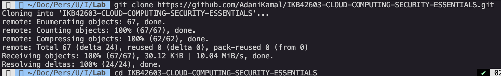
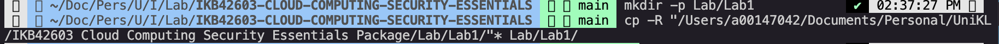
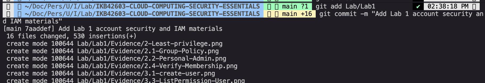
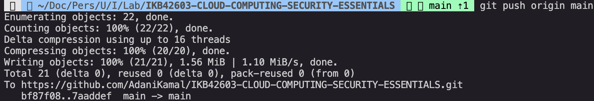

# GitHub Submission Guide: Upload Lab Materials

This guide explains how to upload the Lab 1 report, PDF and evidence images into the existing GitHub repository:

```text
https://github.com/AdaniKamal/IKB42603-CLOUD-COMPUTING-SECURITY-ESSENTIALS
```

## 1. Prepare the Lab Folder

Make sure the Lab 1 folder contains these files:

```text
Lab1/
├── Lab1_Account_Security_and_IAM.md
├── Evidence/
│   ├── 2.1-Group-Policy.png
│   ├── 2.2-Personal-Admin.png
│   ├── 2.4-Verify-Membership.png
│   └── ...
```

The `Evidence` folder contains the lab screenshots.  

## 2. Clone the Existing GitHub Repository

Open Terminal and go to a suitable folder, for example:

```bash
cd ~/Documents
```

Clone the course repository:

```bash
git clone https://github.com/AdaniKamal/IKB42603-CLOUD-COMPUTING-SECURITY-ESSENTIALS.git
```

Enter the repository folder:

```bash
cd IKB42603-CLOUD-COMPUTING-SECURITY-ESSENTIALS
```

Screenshot:



## 3. Create a Lab 1 Folder in the Repository

Create a clear folder path for Lab 1:

```bash
mkdir -p Lab1
```

Copy the Lab 1 files from the original lab folder into the GitHub repository folder.

Example command:

```bash
cp -R "/Users/a00147042/Documents/Personal/UniKL/IKB42603 Cloud Computing Security Essentials Package/Lab/Lab1/"* Lab1/
```

Screenshot:



## 4. Add the Lab 1 Files

Run:

```bash
git add Lab1
```

The files should now be staged for commit.

## 5. Commit the Lab 1 Files

Run:

```bash
git commit -m "Add Lab 1 account security and IAM materials"
```

This saves the Lab 1 files into the local Git history.

Evidence:



## 6. Push to GitHub

Run:

```bash
git push origin main
```

If the repository uses `master` instead of `main`, use:

```bash
git push origin master
```

Evidence:



## 7. Verify on GitHub

Open the repository in a browser:

```text
https://github.com/AdaniKamal/IKB42603-CLOUD-COMPUTING-SECURITY-ESSENTIALS
```

Confirm that the following folder exists:

```text
Lab1
```

Inside the folder, confirm that these items are visible:

```text
Lab1_Account_Security_and_IAM.md
Evidence/
```

## 8. Important Security Check Before Publishing

Before pushing screenshots to GitHub, check whether any screenshot exposes secrets.

Do not publish real cloud credentials, passwords, tokens or secret keys.

